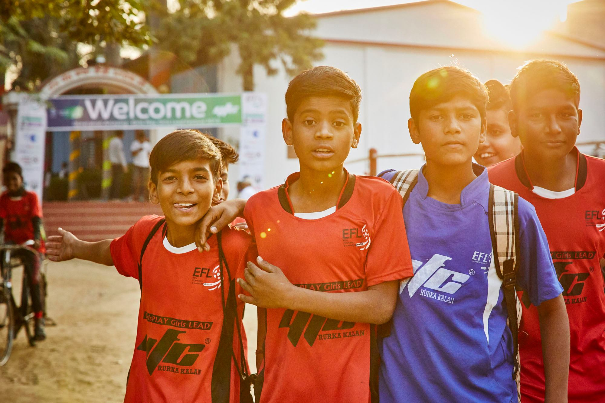

#Youth Football Club Rurka Kalan	
##Wie Bildung und Sport Perspektiven schaffen	

Als ich in Indien das erste mal in Rurka Kalan, dem Hauptstandort von **YFC**, angekommen war und aus dem provisorischen Flughafentaxi gestiegen bin, hat mich neben der unsäglichen Hitze das Team der YFC Mitarbeiter vor Ort herzlich begrüßt und die verschiedenen ansäßigen Projekte vorgestellt. Youth Football Club ist eine 2001 von einer Gruppe engagierter Bewohner um Gurmganal Dass gegründete NGO, die es sich zur Aufgabe gemacht hat, benachteiligten Kinder in Punjab, einem seit jeher für hohen Drogenkonsum bekannten Grenzstaat zu Pakistan, durch Sport und Bildung eine Zukunftsperspektive zu ermöglichen. Was ursprünglich als bescheidener Fußballclub mit Nachhilfeangebot für Kinder nach der Schule begonnen wurde, hat sich inzwischen nicht nur zu einer professionellen Sportakademie mit sozialem Hintergedanken weiterentwickelt, sondern ist zu einer progressiven Community Development Organisation mit einem Physiocenter, einer Kindertagesstätte für behinderte Kinder und zahlreichen Communityprojekten herangewachsen. 